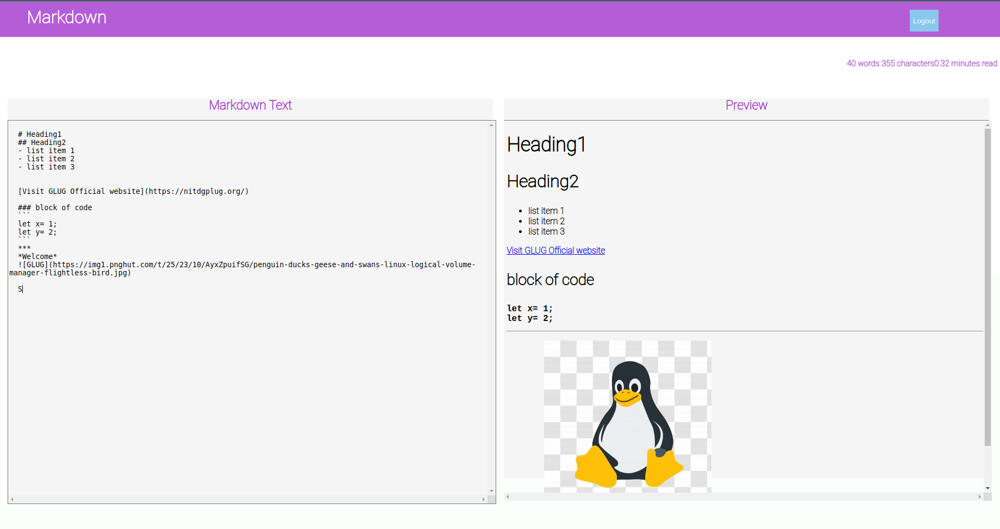

# Markdown Notes Editor


## Frontend
## Sign In/Sign Up Page

## Main Page

 ## Description
 A markdown editor with sign in and sign up page.

***
## Installation and Usage

- Read [CONTRIBUTING.md](CONTRIBUTING.md) file
- Clone this repository.
- Install all dependencies by running 
```
npm install
```
- Run the developement server
```
npm start
```